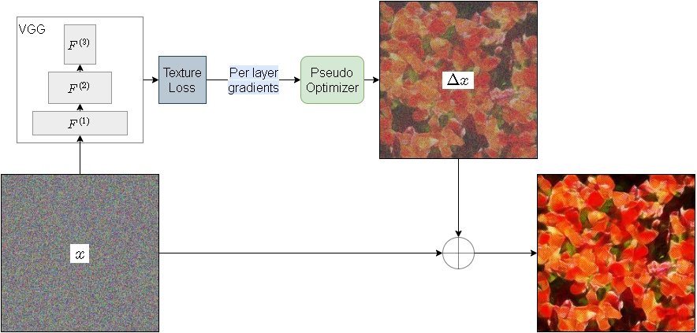

# SynTex: Synthesize Textures Using Deep Neural Networks

## Installation
### Prerequisites
This project requires the following dependencies
* python=3.6
* [tensorpack](https://github.com/tensorpack/tensorpack)=0.9.8
* tensorflow=1.12
* opencv-python=3.4.7.28
* cudatoolkit=9.0

### Installation
Add the path that contains this project (e.g. path/to/syntex) to your `PYTHONPATH`
```
export PYTHONPATH=$PYTHONPATH:path/to
```

## Methods
### [gatys](gatys)
An optimization based method proposed by [Gatys et al.](https://arxiv.org/pdf/1505.07376v3.pdf)

### [po](po)
Fast Texture Synthesis via Pseudo Optimizer. [Paper](https://openaccess.thecvf.com/content_CVPR_2020/html/Shi_Fast_Texture_Synthesis_via_Pseudo_Optimizer_CVPR_2020_paper.html)


## Execution
After setting PO as it is described in `po/README.md` the following commands allows to train and test the pseudo optimizer:

```
./train.sh
```

```
./test.sh
```
